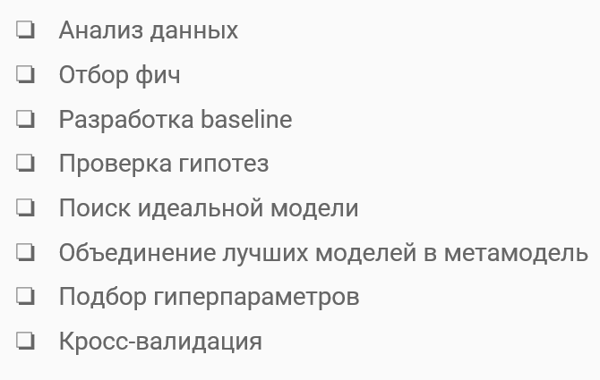
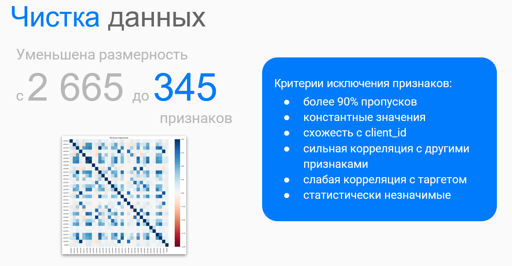
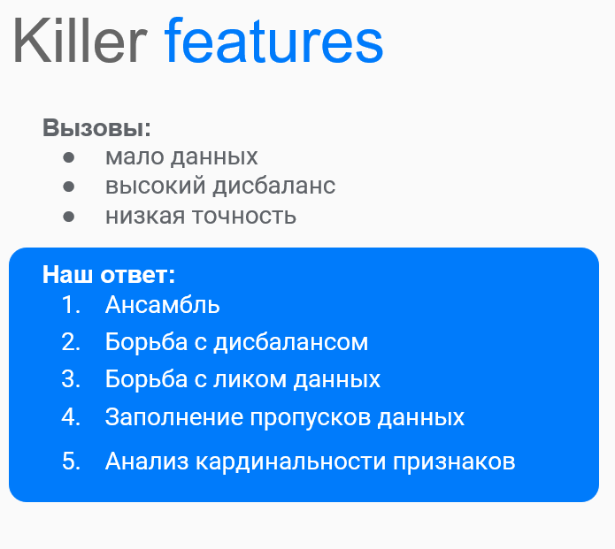
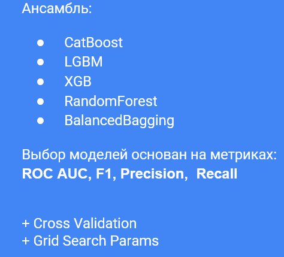
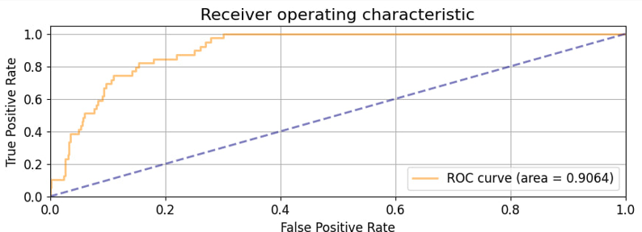
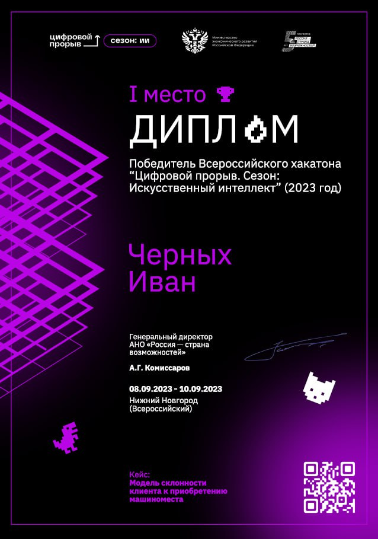

# Победитель всероссийского хакатона «Цифровой прорыв» 2023
https://hacks-ai.ru/hackathons.html?eventId=969091

#### Кейс: Модель склонности клиента к приобретению машиноместа
- Кейсодержатель: [компания "Самолет"](https://samolet.ru/)
- Разработчик команда: "Деревяшки" - 1 место

**Задача**:
Ключевую роль в продажах играет эффективная целевая рассылка.   
Однако каждая рассылка сопряжена с различными издержками, что может негативно сказаться на лояльности клиентов в долгосрочной перспективе.  
На основе больших данных о предыдущем опыте взаимодействия с клиентами участникам хакатона предстоит разработать модель, позволяющую прогнозировать вероятность приобретения клиентами машиномест в паркинге.  
**ТЗ**: [Описание и требования кейса](ТЗ_Самолет.pdf)

Решение:
- [baseline модель](model/baseline.ipynb) 
- [итоговая модель](model/model.ipynb) 
- [итоговая модель на Google Colab](https://colab.research.google.com/drive/13e8LeWvUznXma6zbsgrzqGHe3yruNwcq#scrollTo=k_gOBHg-YryQ)
- [презентация проекта](Презентация_Деревяшки_Хакатон_2023.pptx)


В работе использовались обезличенные данные от компании Самолет [datasets](datasets): 
- train_dataset_Самолет.csv - обучающая выборка 
- test_dataset.csv - тестовая выборка
- submission.csv - итоговый сабмит 

***
#### Схема решения:  


***

***
#### Особенности решения:  

***
#### Модель:  

***
#### Метрика ROCAUC:
 


***

Установка необходимыех пакетов:  
```pip install -r requirements.txt``` 


***

